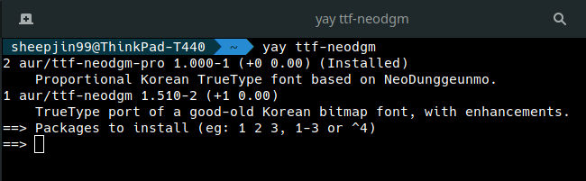

# AUR_ttf-neodgm-pro


Dalgona님의 [Neo둥근모 Pro](https://github.com/Dalgona/neodgm-pro) 글꼴을 쉽게 설치할 수 있게끔 AUR repository에 등록했습니다.

## Prerequisites

AUR 패키지를 설치하기 전에 AUR helper와 의존 패키지들을 설치하는 것이 편리합니다.

ex) Install yay on Arch 
```
$ sudo pacman -Syy
$ sudo pacman -S git
$ sudo git clone https://aur.archlinux.org/yay.git
$ cd yay
$ makpkg -si
```

## Install

```
~ yay ttf-neodgm-pro
```
혹은 다음과 같이 이 저장소를 복제하셔서 빌드하셔도 됩니다.
```
~ git clone https://github.com/RielCho/AUR_ttf-neodgm-pro
~ cd AUR_ttf-neodgm-pro
~ makepkg -si
```
